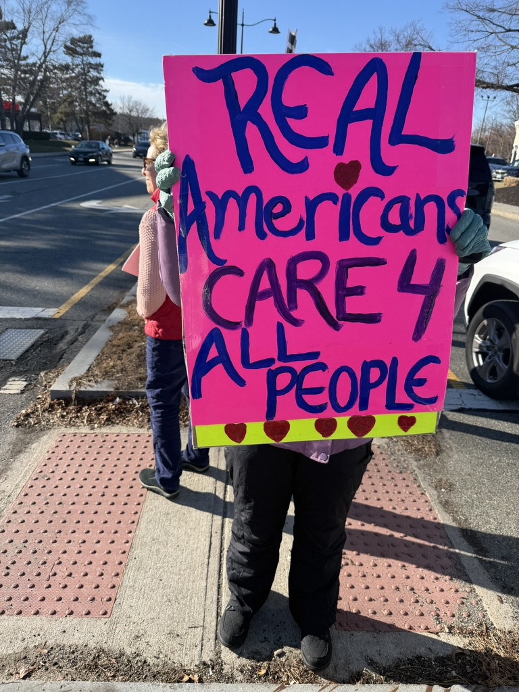
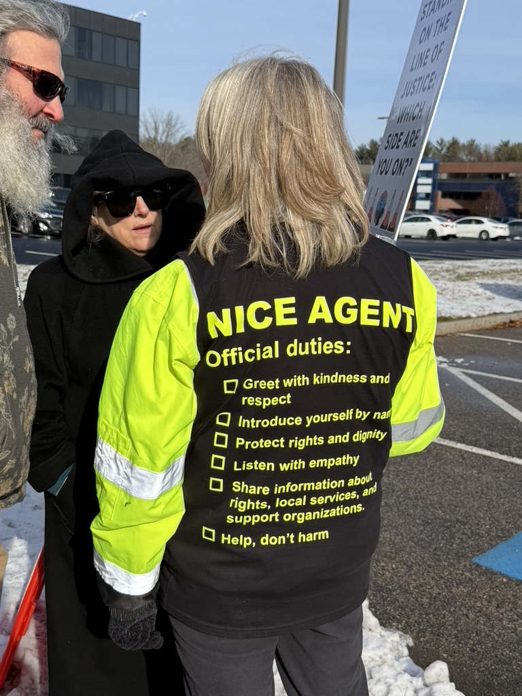
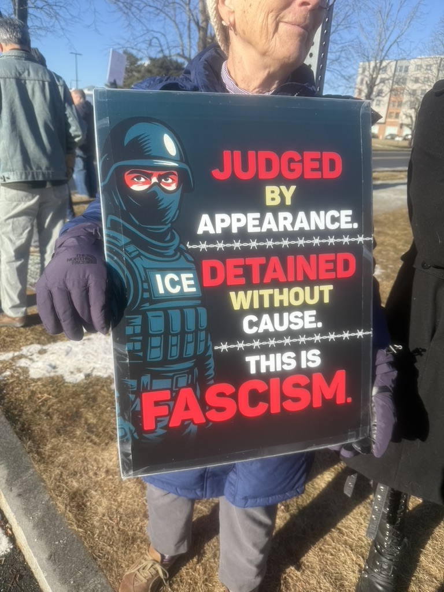
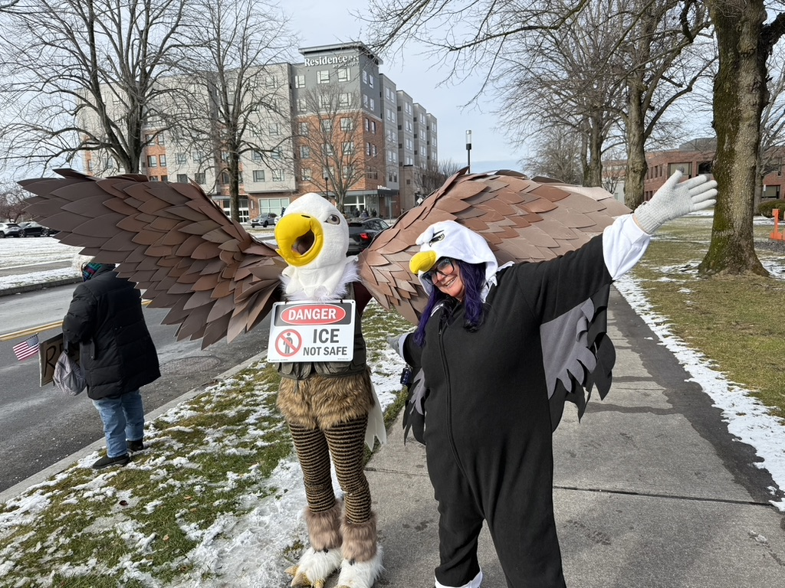

# Monday & Tuesday Protests – Stop ICE Cruelties

**Note:** A lot of the wording on this page was based on the [Bearing Witness website](https://bearingwitnessne.org) and then modified.

General Info

Join us Monday and Tuesday 11-1 to protest the ICE cruelties at the detention center in Burlington, MA at 1000 District Ave.

- **When/Where:**
  - Every Monday and Tuesday
	- 10-12: Gather outside 1000 District Ave with signs and to show solidarity, then march to intersection of District Ave
	and Burlington Mall Road
    -  12-1: Hold signs at intersection of District Ave and Burlington Mall Road.

- **What to bring:** Warm clothes, snack, water, noise makers.  If you bring signs you can drop them off and then park.
- **After:** Lunch at Pressed Cafe.

	
	
	
	

Our Goals: What We’re Demanding

**Demands for the Building:**
- Due process for every individual
- Communication with family
- Visitors for prisoners
- Humane conditions
- Accompaniment for appointments

**Demands for the Town:**
- Inspectors: Make unannounced visits for safety inspections
- Bob Murray (building owner leasing to ICE): Donate all rent profits to immigrant support groups
- National Development (company managing surrounding land and parking lots): Tell ICE to stop parking in lots; support peaceful protests

**Demands for the State:**
- Zero cooperation with ICE
- Proactively inconvenience ICE
- Support for immigrants and advocacy organizations
- Pro-immigrant legislation

**Demands for the Federal Government:**
- Elected officials to make repeated, unannounced inspections
- Elected officials to show up in your communities to stand with constituents and immigrants
- Abolish ICE

**Our Goals: What we’re asking of ourselves**
- Remain a nonviolent, inclusive peaceful protest for solidarity, education, and connection
- Show love and support for immigrants
- Remain focused on bearing witness without getting distracted
- Exchange knowledge and opportunities
- Build the movement and achieve extreme solidarity
- "Regardless of your views on any other issues, if you support immigrants and their constitutional rights and are committed to nonviolence we want you to join us."
- Support immigrants, advocacy organizations, and other protest actions
- Make ICE facility an inescapable feature of Burlington for residents and visitors
- Influence local, state, and federal officials
- Build relationships with local businesses

**Our Tactics:**
- We will never win hearts and minds with violence, only through peace.
- Our consistency – our weekly presence, our unwavering commitment to nonviolence, our singular focus on immigrants’ constitutional and human rights – is our power and the key to growing support and expanding our influence.

Guidelines

- We protest peacefully.
- We do not antagonize or engage with counter pro-ICE protestors. Do not use the median near the cross walk. They get energy from engaging with us and can use these interactions to attract followers.
- We do not block the entrance, approach ICE agents, or block traffic on District Avenue.
- We do not stand in restricted areas as designated by Burlington police.
- We protest systems, not people. Our goal is moral clarity without hostility. If an ICE vehicle passes, consider phrases like "No cages, no cruelty", "You can quit", "Do the right thing, quit", "Stop the cruelty/destroying families/breaking the law", or "Show compassion".

Tips for Handling Counterprotesters

Please report the incident to a marshal in a bright vest.
 - Move to a different place
 - Do not respond to taunts
 - If you are being filmed, put a sign up in front of your face
 - Look to the side
 - Look for a marshal in a bright vest

Please report the incident to a marshal in a bright vest.

Photography and Video Recording

Attendees should be aware that Bearing Witness standouts are held in a public space. Photographers and videographers capture images and videos at each standout.

Those uncomfortable with being photographed or recorded may wish to consider other ways to help immigrants.

<!-- 

Safety
 -->

<!-- <ul>
	<li>Marshals in fluorescent vests are scattered throughout the crowd. If you encounter a problem, seek out a marshal.</li>
	<li>Medics in blue fluorescent vests are also present. They have water, snacks, hand warmers, and first aid kits.</li>
	<li>Before arriving, please consider your own self-preservation (citizenship status) and self-care (sunscreen, hydration, etc.).</li>
</ul> -->
<!-- 
 -->

Public Transportation

<ul>
	<li>The MBTA bus <a href="https://www.mbta.com/schedules/350/line">route 350</a> starts at Alewife Station and has stops near to District Ave.</li>
	<li>The LRTA bus <a href="https://lrta.com/routes/route-14/">route 14</a> starts at the Kennedy Center in Lowell and uses the same stops close to District Ave. Some people have reported parking at Wegman's and taking the LRTA route 14 bus to the protest.</li>
</ul>

Parking

<a href="parking.html" style="font-size:1.3em; color:#23408e; font-weight:bold; text-decoration:underline;">Click here for parking info</a>

