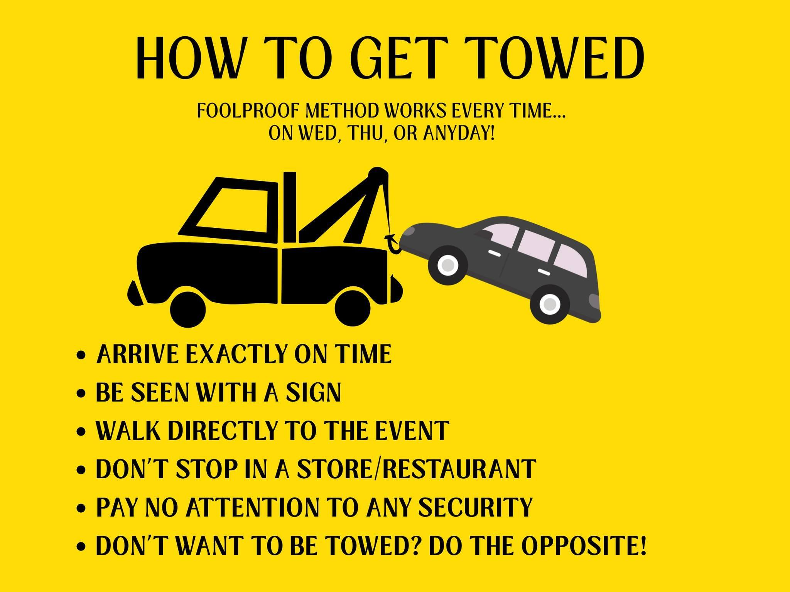

# Parking

🚫 **DO NOT PARK AT AMC MOVIE THEATER. AMC DOES NOT ALLOW PROTEST PARKING.**

Parking policies and enforcement can change. Please use your own judgment and choose the option that best matches your comfort level.

---

### Quick Summary

- 🚫 Do not park at AMC.
- 🚗 Public parking is available at TRW Playground (Stony Brook Rd).
- ⚠️ Commercial lots carry a risk of towing.  Discretion advised.
- 📢 If towed, notify the group organizer and review tow dispute guidance on the Bearing Witness website.
- ✅ Temple Shalom Emeth and United Church of Christ have granted permission to park on Wednesday, unless there is a conflicting event.
- 🚗 Wed and Thu there may be a shuttle from a designated location.  Check with the respective facebook pages or website.

---

### 📍 Public & Approved Parking

<strong>Weekly Designated Shuttle Location(s)</strong>

Bearing Witness on Wednesday and Justice4All Thursdays has been known to shuttle
from a designated location.  See website or facebook pages for more info.

<strong>TRW Playground (Public Lot)</strong>

**Address:** 28 Stony Brook Rd, Burlington, MA  
Approximately 0.8 miles from District Ave (30+ spaces available).

*Note:* If you enter “TRW Playground” into navigation, some map apps may suggest an illegal turn. It is best to navigate directly to **28 Stony Brook Rd**.

<strong>Temple Shalom Emeth</strong>

**Address:** 16 Lexington St, Burlington, MA  
You can park there on Wednesday.  
Check the Bearing Witness Facebook for possible shuttle coordination.

<strong>United Church of Christ Congregational</strong>

**Address:** 6 Lexington St, Burlington, MA  
You can there on Wednesday.  The location is very close to Temple Shalom Emeth.  
Check the Bearing Witness Facebook for shuttle coordination.

---

### ⚠️ Commercial Lots
YOU PARK AT YOUR OWN RISK
If you decide to park in a commerical lot use discretion.  
Security officers may not be in marked cars.

<strong>What Not To Do</strong>

<strong>Sign Drop Off </strong>

Organizers have a lot of signs, so you do not need to bring your own sign.  If bringing your own sign, you can drop it off before parking:  
	- **Wed, Thu, Fri:** 1000 District Ave  
	- **Mon, Tue:** 1000 District Ave.  If no one there, check corner of District Ave & Burlington Mall Road
	- **Sat:** Corner of District Ave & Burlington Mall Road  
	- Do not leave signs unattended if no one is present.  
**YOU PARK AT YOUR OWN RISK**

<strong>Kohl’s</strong>

Many participants have parked here without issue.  
No towing has been reported from this location.

<strong>Strip Mall (Just Salad Plaza)</strong>

New “No Parking” signs have been posted, and there have been reports of monitoring.

The lot is visible from Burlington Mall Road.  
On Mon, Tue, and Sat (when groups gather there), activity in the lot can generally be seen from the gathering area, which may allow you to return promptly if enforcement activity appears.

<strong>Burlington Mall</strong>

Some participants have reported being questioned even when not near their vehicles.  
No towing has been reported to date.

<strong>District Ave (Including Street Parking)</strong>

Towing has occurred in this area, including from street parking.  
Retrieval costs have been approximately $180.  Do not assume if you see no security patrol you are 
safe. 

---

